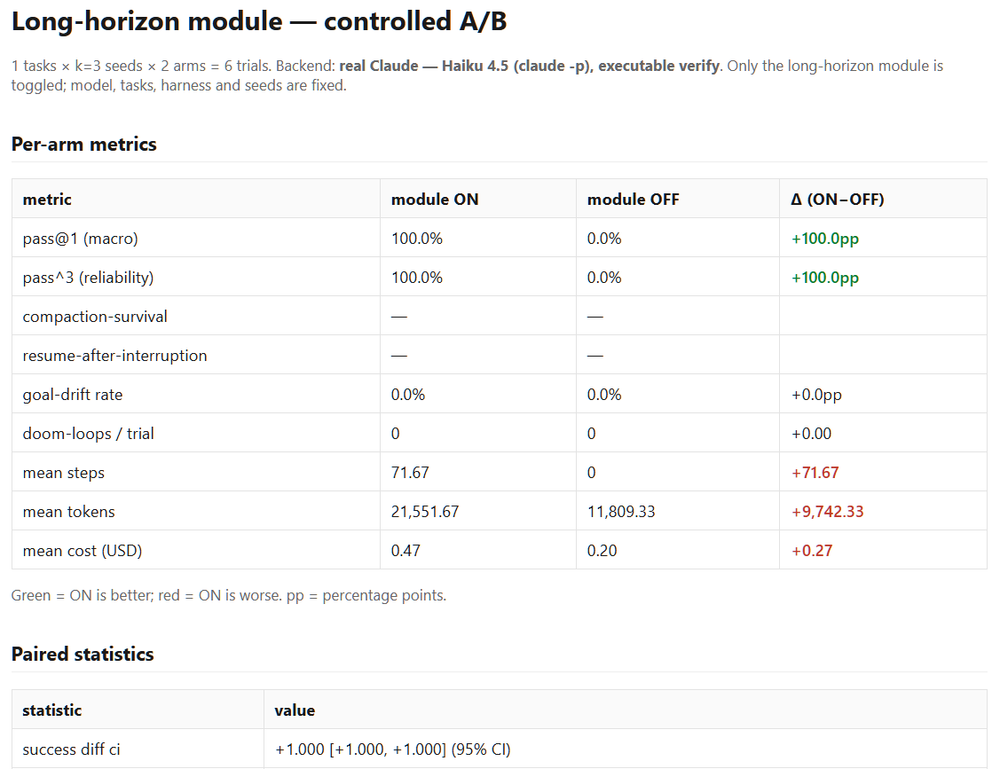

# Long-Horizon 扩展模块 `lhx` 与它的评估系统

方向 **Long-horizon**，目标 agent **Claude Code**。交付两部分：(1) 给 Claude Code 补齐长程任务执行能力的扩展模块 `lhx`；(2) 回答「新版本在产品里真的更好吗」的评估系统。全文按 **Agent / Harness /
Task / Eval** 四层组织（主流长程基准的标准解耦）。

## 解耦四层

| 层 | 实现 | 职责 |
|---|---|---|
| **Agent**（§1） | `backend`：仿真 / `claude -p` / Agent SDK | 谁执行任务；A/B 中固定不变 |
| **Harness**（§2） | `lhx` 六个 hooks + 磁盘状态 + evaluator | 包在模型外的长程脚手架，**被测对象** |
| **Task**（§3） | `tasks/*.json`（prompt/setup/verify/参考解） | 任务规格，含 golden-behavior 回归子集 |
| **Eval**（§4） | runner + sandbox + graders + metrics + stats + dashboard | 打分、量化不确定性、呈现结果 |

> 术语：本文的 Harness 取 Anthropic *Effective harnesses* 的含义，即 `lhx`。Harbor /
> Terminal-Bench 解耦里的 "harness"（指执行框架 runner/沙箱/Docker）在本文归入 Eval 层（§4.5）。

---

## 1. Agent：执行主体与 A/B 驱动

Agent 层是执行任务的主体，也就是未经改动的 Claude Code。`lhx` 通过 hook 挂在它外围（挂载机制见
§2），评估时同一个模块可以接到三种可互换的 backend，A/B 中 backend 保持固定、只翻转模块。

| 局限 | 改进 | impact |
|---|---|---|
| Anthropic cwc（长程 harness 示例仓库）的原语散落在各 shell 脚本里，无法整体开关，效应也就无法归因 | 收敛到单个 [Config](lhx/config.py)，用一个布尔 `LHX_ENABLED` 切换 ON/OFF | 两臂只差这一个开关、其余完全相同，效应可以干净归因（§4.1） |
| 只跑真实后端时，评估非确定、要计费，还缺 ground truth 在相信数字前校准装置本身 | 加一个确定性的 `simulated` backend，与 `claude -p` CLI、Python Agent SDK 共用同一套 runner/grader/指标（真实跑用 `--output-format json` 抓 cost/token） | 既能离线、零成本、确定地校准装置（§2.3），又能在同一份任务/指标上跑真实模型看能力 |
| `claude -p` 单会话跑不出长程差异 | multi-session 模式：在同一工作区反复 fresh 调用（不加 `--continue`），每次限制 turn 数，会话之间用 verify 判断是否收敛 | 这是 v05/v06/v07 真实 A/B 的运行基础（§5） |

---

## 2. Harness：`lhx` 脚手架

`lhx` 通过 Claude Code 的 hook 生命周期（stdin/stdout 收发 JSON）挂在 agent 外围，不改模型、不改
agent loop。六个 hook：SessionStart（注入 resume 上下文）· PreToolUse（kill/steer/doom/budget）·
PostToolUse（事件轨迹 + MEMORY + PROGRESS）· PreCompact（备份）· Stop（completion gate +
checkpoint）· SubagentStop（evaluator 裁决），正好是下表「落点」列的来源。

> 注：Claude Code 2.x 默认不加载 project 作用域的 hooks，必须显式传 `--setting-sources project`，否则模块完全不生效（详见 §2.4）。

### 2.1 失效模式 → 缓解

`lhx` 针对一组可命名、可观测的长程失效模式。"=" 表示与来源做法相同，"+" 表示新增或修改。

| 失效模式 | 缓解 | 落点 | 关系 |
|---|---|---|---|
| **M1** 想一次做完、中途耗尽 context | default-FAIL 特性契约 + 一次只做一个特性 | SessionStart/Stop；[state.py](lhx/state.py) | = cwc |
| **M2** 过早宣布完成 | completion gate（完成门控）+ fresh-context evaluator | Stop、SubagentStop | = evaluator / **+** 门控 |
| **M3** context rot（注意力预算耗散） | 状态落盘 + 常量大小的 `MEMORY.md` | PostToolUse | **+** Codex |
| **M4** 跨会话健忘 | progress ledger + SessionStart 主动注入 | SessionStart | = handoff / **+** 主动注入 |
| **M5** doom loop / 成本失控 | `(tool,args)` 哈希的重复检测 + step-budget 熔断 | PreToolUse | **+** Kilocode |
| **M6** 目标漂移 | 周期性 reflection + 不可变的 `BRIEF.md` | PostToolUse | **+** 社区/Codex |
| **M7** 中断后无法恢复 | git checkpoint + 结构化的 `.lh/checkpoint.json` + resume 注入 | Stop/SessionStart | = commit-on-stop / **+** 结构化 |

每个方法都单一可开关，支持逐个消融。参考来源：Anthropic *Effective harnesses* /
*Context engineering* / *Demystifying evals*、[`cwc-long-running-agents`](https://github.com/anthropics/cwc-long-running-agents)、Codex `/goal`、Kilocode。

### 2.2 与现有工作的核心差异

| 局限（现状） | 改进 | impact |
|---|---|---|
| cwc 的 `verify-gate.sh` 靠「读过某个后缀的文件」判定完成，这只是证据代理、可以被绕过 | 换成 completion gate + fresh-context evaluator 复现来判定 | 完成评分不再依赖 agent 自评；代价是没有移植硬写入门（列入 §6） |
| cwc 没有评估，也没有 long-horizon 指标 | 配套整套配对 A/B + 长程专属指标 | §4、§5 |

**门控的盲区**：completion gate 判据是 `feature_list.json` 全部 pass，而这个字段由 agent 自己
`mark_pass` 翻转，所以门控本身可以被自报绕过，只有离线评分的 `verify` 能兜住。在产品语境下（线上没有 eval verify 兜底时）这是一个真实的攻击面，改进方向见 §6（让门控也参考 verify 结果）。

### 2.3 Harness 验证：用概率仿真 agent 证明装置可靠

**局限**：真实跑是非确定的、没有 ground truth，无法判断「脚手架 + 度量装置」本身是否正确。

**改进**：仿真 backend 用显式概率建模 M2–M7，每个缓解都**挂在真实的 `Config` 开关上**；配合参考解
sanity check（参考解必须 pass、空产出必须 fail）、regression 阴性对照，以及 53 项单测（pass@k
对齐 Chen 闭式、McNemar 精确 p、bootstrap 在零假设下覆盖 0、仿真跨进程确定）。

**impact**（16 任务 × k=10 × 2 arm = 320 trial，即 `lhx-eval run -k 10` 的输出）：

| 指标 | ON | OFF | Δ |
|---|---|---|---|
| pass@1 | 91.2% | 50.6% | +40.6pp |
| pass^3 | 76.2% | 40.4% | +35.8pp |
| compaction 存活 | 84.3% | 17.1% | +67.2pp |
| resume 成功 | 93.3% | 13.3% | +80.0pp |
| 目标漂移 | 0.0% | 53.1% | −53.1pp |
| doom-loop 频次（次/trial） | 0.24 | 0.92 | −0.68 |

配对 Δ +0.406 [+0.331, +0.481]；McNemar helped=66、hurt=1、p≈9e-19。regression 子集是干净的阴性对照（两臂都 1.000，无误报），单个 hurt 是一对方向相反的 discordant pair，属噪声。

**这个验证的边界**：失效概率只施加在 OFF 臂上，仿真在构造上只可能得出 ON 更好，所以它**不**证明模块的真实能力。它连同 53 项单测，证明的是**评估管道的数值正确性**（统计公式与跨进程确定由单测保证，端到端接线、聚合、regression 对照无误报由这次跑通验证），但**没有**验证两件评估里最难的事：
grader 能否抵御 reward hacking、指标在真实噪声下的区分度，后两者只能靠 §5 的真实 A/B。

### 2.4 验证过程抓出的两个真实 bug

这两个 bug 只看汇总 pass/fail 都发现不了，查事件轨迹才暴露；两个都补了回归测试。

| bug | 现象 | 修复 |
|---|---|---|
| 漂移假阳性 | ON 报 66.7% 漂移，实为关键词启发式在合成 token 上误报 | ground-truth 漂移改由 backend 提供，关键词启发式只作用于真实散文 |
| 模块静默失效 | 报 `success=True` 却 0 事件：`LHX_CONFIG` 被塞成 JSON 串，触发 `OSError: File name too long`，每个 hook 静默崩溃、模块全程不生效 | `from_env` 改为防御性解析 + 配置落文件；由此发现须加 `--setting-sources project` |

---

## 3. Task：任务集设计

### 3.1 两类任务

评估要回答两个产品问题：一次改动（模型发布时是新版本，本方案里是 harness ON/OFF）**让它更强了吗**，以及**有没有破坏原有行为（golden behavior）**。两类任务分别管这两问：

| 子集 | 两臂预期 | 对应产品问题 |
|---|---|---|
| **capability**（t01–t06、v03–v07） | 起点低，模块可能拉开差距 | 改动让它更强了吗 |
| **regression = golden-behavior 守门**（r01–r03、v01–v02） | 两臂都应≈100%，任一掉下即回归信号 | 改动破坏原有行为了吗 |

### 3.2 什么样的任务才让脚手架有用

**局限**：现在的 agent 很强、会自动调工具，多数任务一个 session 就做对了，ON 反而只多付通信开销（§6.1）。OFF 也能成功，是因为总有逃生口：pytest 给确切 N/M、文件系统暴露历史决策、任务塞得进单会话、或 shell 批处理绕过 context（v03/v04/v06 系列/v08/v09 一路跑出来的）。

**改进**：提炼正 delta 的四个必要条件：超出单会话、完成信号主观、跨会话状态确实重要、无 context
捷径。再用两个旋钮构造出真正的长程 regime：受限 `max_turns` 让 agent 无法一次做完、工具白名单（如禁
Bash）堵掉 v04 的批处理捷径。据此写 7 个 executable-verified 任务，每个带参考解证明可解。

**impact**：由此得到 v05（build 场景没有测试反馈）和 v06（debug 场景按 session 隐藏全局套件）两个「完成信号主观」的任务，都能稳定产生正 delta（§5）。任务表：

| 任务 | 类型 | verify 检查 |
|---|---|---|
| v01-slugify / v02-health-endpoint | regression | 单函数 / 真正启动 HTTP server 并探测 `GET /health→200` |
| v03-tasklib | capability | 4 模块的包 + pytest |
| v04-bigrepo-audit | capability | 50 个臃肿模块（~178k token），每个加 `AUDITED=True` |
| v05-incremental-app | capability | 10 个互相 import 的模块，prompt 要求「一模块一 session、先读 PROGRESS」 |
| v06-debug-session-scoped | capability | 8 个模块各 1 bug，prompt 约束「一模块一 session、禁跑全量套件」 |
| v07-debug-amnesiac-pytest | capability | debug 任务，限制 pytest 次数 + 强调跨会话健忘 |

---

## 4. Eval：评估框架

### 4.1 配对 A/B
每个 `(task, seed)` 用同一种子跑 ON/OFF 两臂，配对内方差相互抵消；每任务 k 个种子。一次 trial 的流水线：`backend.run → grade → 聚合 → 统计 → dashboard`（[runner.py](lhxeval/runner.py)）。

### 4.2 三条正交轴（决定每个数字的含义）

| 轴 | 模式 | 何时用 | 代价 |
|---|---|---|---|
| **Backend** | simulated | 校准装置 | 离线确定，不反映真实能力 |
| | real（CLI/SDK） | 真实 Claude、真跑 hooks | 需 key、计费、非确定 |
| **Grader** | 确定性 token/状态 | 结构化 artifact，快而客观 | 只对结构化产出有意义 |
| | 可执行 F2P/P2P | 对产出工作区跑真实测试判退出码 | 任务规格必须机器可验证 |
| | model-judge | 主观/开放式产出 | 需校准、自身有方差 |
| **Metric** | pass@1 / pass@k | 能力：k 次里至少一次成功 | 会把碰运气的成功排在稳定之前 |
| | pass^k | 可靠性：k 次全过 | 一个不稳的 grader 就把它压塌 |
| | token / cost / steps | 效率：同样成功下多花多少资源 | 需与 success 联读才有意义 |

**明确拒绝的反模式**：agent 自报。信任 agent 写回 `feature_list.json` 的声明会被它钻空子（reward hacking），所以评分一律绕过自评——仿真读 backend 的结构化输出，真实读磁盘产物 + `verify`。

### 4.3 指标（[metrics.py](lhxeval/metrics.py)）
pass@k（Chen 闭式）、pass^3、long-horizon 专属（compaction 存活 / resume 成功 / 漂移率 /
doom-loop 频次），以及**把 token/资源效率当一等公民**（v07 唯一的收益就是效率，§5.5）。
compaction（上下文压缩）存活、resume 成功是**条件性指标**，分母是「真触发过该事件的 trial 数」；分母为零时渲染成 "—"，表示「无数据」而非「模块失效」（例如 v04 被 shell 绕过、从未触发 compaction，该栏即为 "—"）。

### 4.4 统计（[stats.py](lhxeval/stats.py)）
配对 bootstrap CI、McNemar 精确检验（配对二元结果，报 helped/hurt/discordant + 精确双侧 p）。纯 Python、无正态近似、零 scipy 依赖，整套离线且确定地运行。真实 A/B 的 k=3 太小，`[+1.00,
+1.00]` 是 bootstrap 在「三点全同」上的退化产物、无信息量，以 McNemar 的 p 下限为准（§5.3）。

### 4.5 执行框架卫生 + dashboard
每个 trial 在全新临时工作区运行（id 经消毒防路径逃逸），跑完销毁，**不留跨 trial 的文件或 git
历史泄漏**（Anthropic 观察到 agent 会读上一 trial 的 git 历史获利）。产出自包含的
`dashboard.html`（无 JS/CDN）：per-arm 表、配对 Δ + CI、McNemar、pass@k vs pass^k 曲线，直接交给产品团队、不读代码就能看懂「有没有破坏行为、代价是多少」。



*上图：v06 真实 A/B（Haiku 4.5）dashboard 上半部分，ON 3/3 vs OFF 0/3，附配对统计与成本。*

### 4.6 对有效性的威胁 & 与主流基准对齐
威胁：任务歧义、grader 被绕过、环境不稳、饱和、模型非确定。缓解：参考解 sanity check、平衡的
capability/regression、确定性 grader 优先、读 transcript（连 SWE-bench Verified 都在 2026-02 [被 OpenAI 停用](https://openai.com/index/why-we-no-longer-evaluate-swe-bench-verified/)（测试缺陷 + 训练污染），更说明参考解纪律的重要）。本方案的 `verify` 检查与 Harbor 的 pytest-F2P、
OSWorld 的 evaluator 脚本**同构**（都按产出的真实状态判定），所以接 Terminal-Bench / SWE-bench 是
**写一个薄 adapter** 的工作量，而非重构（§6）。

---

## 5. Tests：逐用例 A/B（真实 Claude Haiku 4.5，executable verify）

每个用例回答同一个问题：**这类任务上脚手架 ON 有没有正收益，为什么。**

| 用例 | 结论 | 机制 | 有正收益？ |
|---|---|---|---|
| **v01–v03** 单会话量级 | ON=OFF 成功，ON 多付 ~30–50% token | `claude -p` 不强制 compaction，跨会话机制没被触发 | 否（正确的负对照） |
| **v04** 178k-token audit | ON=OFF，无 compaction，$0.079/11 次工具调用 | Haiku 用 `sed`/`python3 -c` 批处理，178k token 从没进 context | 否（长程场景被绕过，保留作负例） |
| **v05** build 跨会话 | ON 3/3 vs OFF 0/3 | 见 §5.3 | **是（success）** |
| **v06** session-scoped debug | ON 3/3 vs OFF 0/3 | 见 §5.4 | **是（success，第二种形态复现）** |
| **v07** amnesia + pytest 限制 | 两臂都成功，ON −45% token | 见 §5.5 | **是（efficiency）** |

### 5.3 v05（k=3，max_turns=80，max_sessions=3，$2.16）

| metric | ON | OFF | paired Δ |
|---|---|---|---|
| success | **3/3** | **0/3** | +1.000（见下方 CI 说明） |
| partial | 1.000 | 0.310 | +0.692 |
| tokens/trial | 29,392 | 5,650 | +23,742 |
| cost/trial | $0.599 | $0.121 | ~5× |

机制：**ON** 在 session 1 建好约 9 个模块、逐个 `mark_pass`，Stop 门控见还没全部 pass 就拦下来、迫使 agent 继续；session 2 补完最后一个模块和测试，verify 通过。**OFF** 每个 session 只做 2–4 个模块、自报「做完了」、没有门控拦截就早停，3 个 session 后仍卡在 partial 0.31。三个种子零方差、完全可复现。tradeoff 清楚：ON 贵 5 倍但 100% 成功，OFF 便宜但 100% 失败。
> CI 说明：n=3 下 success delta 的 bootstrap CI 退化为 `[+1.00, +1.00]`，不当真置信区间用；
> McNemar 在 n=3 discordant 时 p 触底于 0.25，是样本量下限，不是效应量问题（§6 会把 k 提到 ≥5）。

### 5.4 v06（k=3，max_turns=60，max_sessions=4，$2.03，`runs/v06d_k3/`）

| metric | ON | OFF | Δ |
|---|---|---|---|
| success | **3/3** | **0/3** | +1.000（同上 CI 说明） |
| partial | 1.000 | 0.500 | +0.500 |
| tokens/trial | ~21,552 | ~11,809 | ON 更多 |

把 v05 的机制搬到 debug 上复现：按 session 隐藏全局测试套件，「整个库修完了吗」就退化成主观判断，正是 M2。门控迫使 ON 在 1–2 个 forced session 里修完全部 8 个模块；OFF 遵守「一模块一 session」、又没有全局 oracle 提示，几个 session 后停在约 4/8。**一点保留**：这个 delta 带构造成分，「一模块一
session」的约束加上 max_sessions(4) 小于模块数(8)，OFF 会先耗尽会话预算；它证明的是门控机制在
build 和 debug 两种形态上各自复现，而不是一个野外发现。去掉构造成分需要放宽 max_sessions（§6）。

### 5.5 v07：方向相反的收益
ON 不总是更贵。这里两臂都成功、没有 success delta，但 ON 的 PROGRESS.md 让每个冷启动 session 省掉「重新搞清楚哪些已经修好」的重复开销：**ON −45% token / −12,652 [−14,380, −10,924]，统计显著**。需要「逼着做完更多」时 ON 更贵（v05/v06），需要「跨会话重新定向」时 ON 反而更省（v07）——成本不是一律的开销。

### 5.6 评估过程中抓出的两个脚手架 bug（拿到 v05 正 delta 之前）

| bug | 现象 | 修复 |
|---|---|---|
| PROGRESS.md 从未落盘（M4 断链） | 门控每次都拦下 Stop，导致 `ledger.append` 永远执行不到 | 改为 PostToolUse 在每次 Write/Edit 后追加一行，配单测 |
| CLAUDE.md 措辞导致 read-doubling | "read back concrete evidence" 被 agent 直译成重新 Read 每个文件，Read/Edit 比达 4.5:1 | 改成「Edit/Write 的结果本身就是证据，不要重新 Read」 |

---

## 6. 未来工作
- **去掉 v05/v06 的构造成分**：把 max_sessions 放宽到接近模块数，让 OFF 的失败更多来自真实的「过早宣布完成」而非会话预算耗尽；把多特性结构和 168k-token 内联 compaction 触发合并起来测 M3。
- **真实中断注入**：目前 `Directives` 只被仿真 backend 使用，真实 backend 还没接线；SDK 路径可直接
  `raise CancelledError`（比 CLI 的 SIGKILL 干净），接上后即可真正考 M7 的 checkpoint + resume。
- **Harbor adapter** 接 Terminal-Bench 2.0 / SWE-bench-Pro：因为 `verify` 与其 pytest-F2P 等价，是 adapter 工作量而非重构；本 take-home 因算力未实跑，但离线仿真 + 小规模真实 A/B 已验证链路每环。
- **线上/离线闭环**：同一套 task/grader/metric 可复用于线上监控——离线 A/B 定 golden-behavior
  警戒线，线上按同样的 verify 抽样打分回灌，形成 offline → online → offline 闭环。
- **收紧统计与门控**：k 提到 ≥5，把 McNemar 从 p=0.25 下限推到 <0.05；让完成门控也参考 verify
  结果（堵住 §2.2 的自报攻击面）；引入 model-judge 处理开放式产出；产出上 Docker 隔离。

## 7. 安全 & 复现
最小权限 `allowedTools`（evaluator 无写工具）、kill-switch + steering、门控提供 human-in-the-loop、
`max_budget_usd` + step-budget 熔断、隔离沙箱、完整 transcript 审计。

```bash
pip install -e . && python scripts/seed_tasks.py && lhx-eval validate
pytest -q                                            # 53 tests
lhx-eval run -k 10                                   # 仿真校准（16 任务）→ runs/latest/dashboard.html

# 真实 Claude 需 .env 里的 ANTHROPIC_API_KEY。每个任务的多会话设置随任务定义走
# （schema.RunConfig 自动生效），所以直接 --task-id 即可复现，不必记 env 旋钮：
cp .env.template .env
lhx-eval run --backend sdk --task-id v05-incremental-app -k 3        # 正 delta：ON 3/3 vs OFF 0/3
lhx-eval run --backend sdk --task-id v06-debug-session-scoped -k 3   # 正 delta：ON 3/3 vs OFF 0/3
lhx-eval run --backend sdk --task-id v07-debug-amnesiac-pytest -k 2  # efficiency：两臂成功、ON −45% token
lhx-eval run --backend sdk --verified-only -k 1                      # 全部 verified 任务，各用自己的设置
# 需要时用 LHX_SDK_MAX_TURNS / LHX_SDK_MAX_SESSIONS 覆盖任务默认。
```
